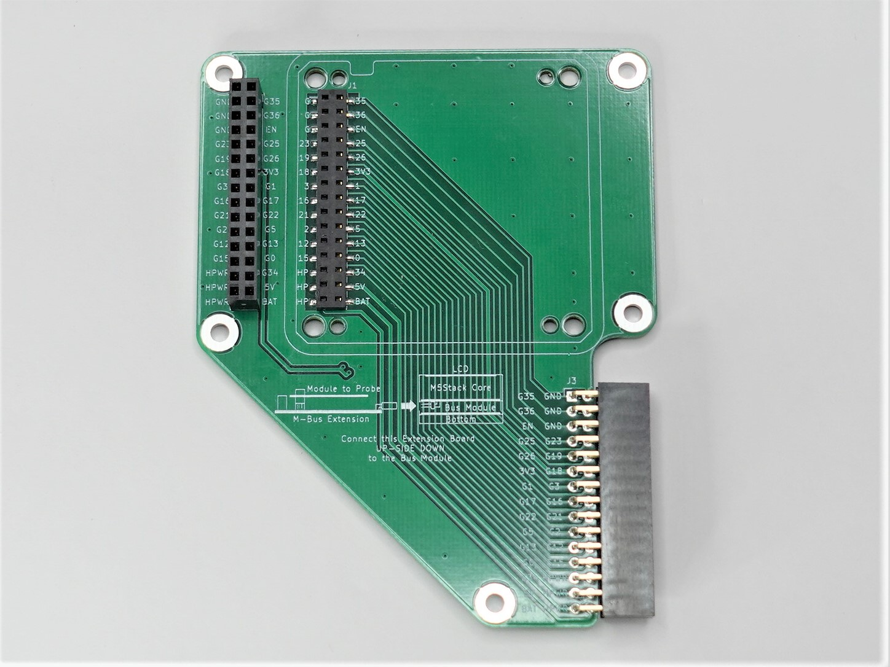
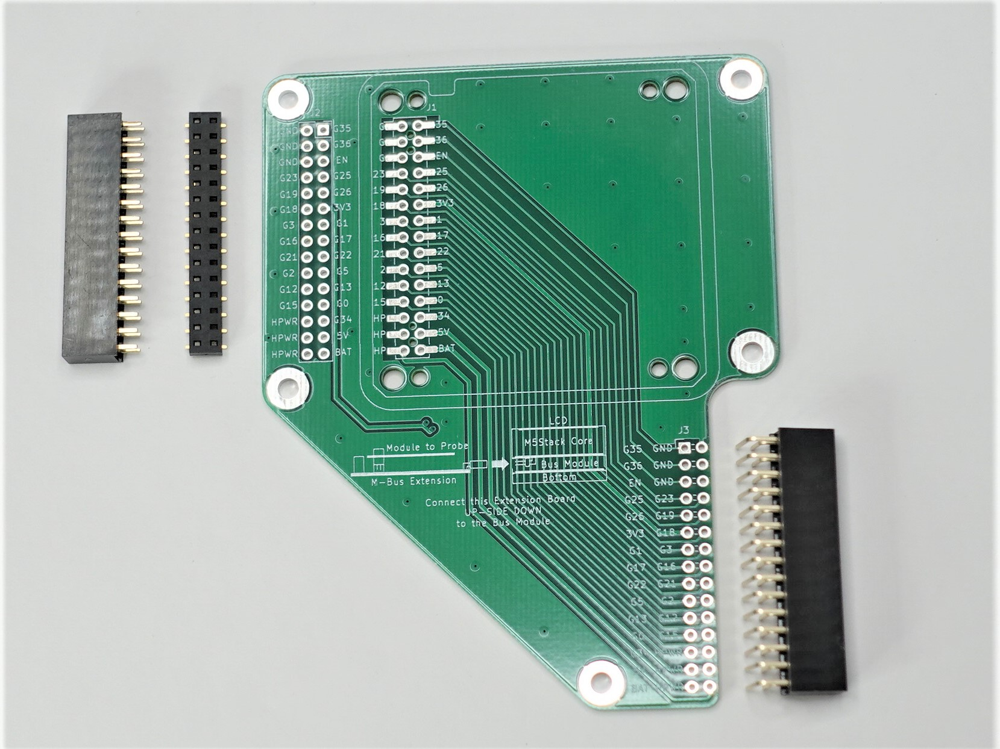
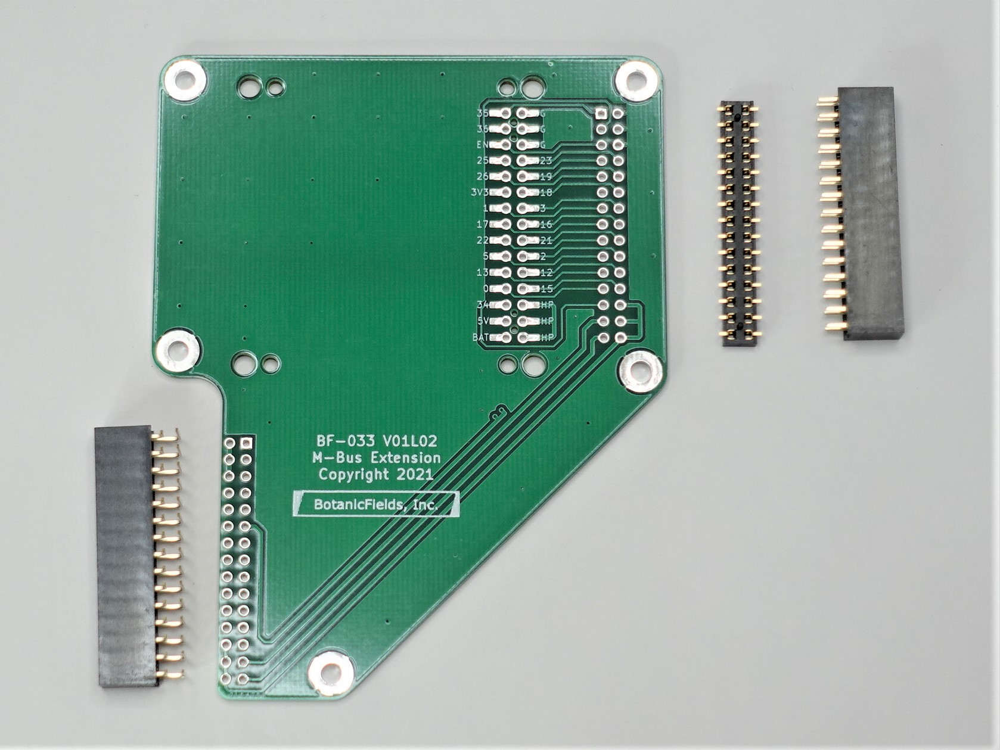
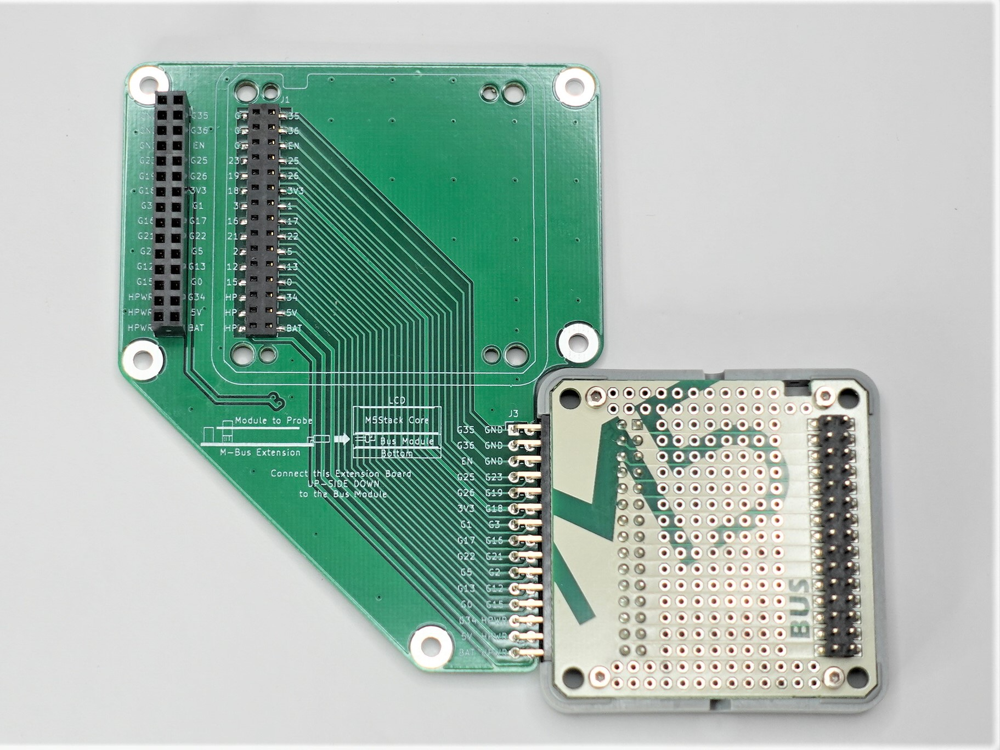
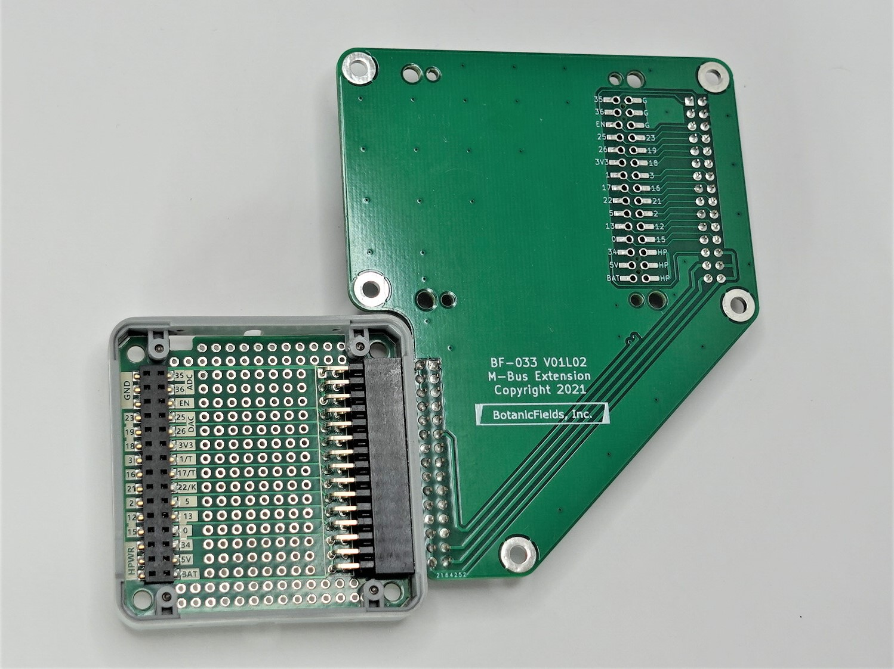
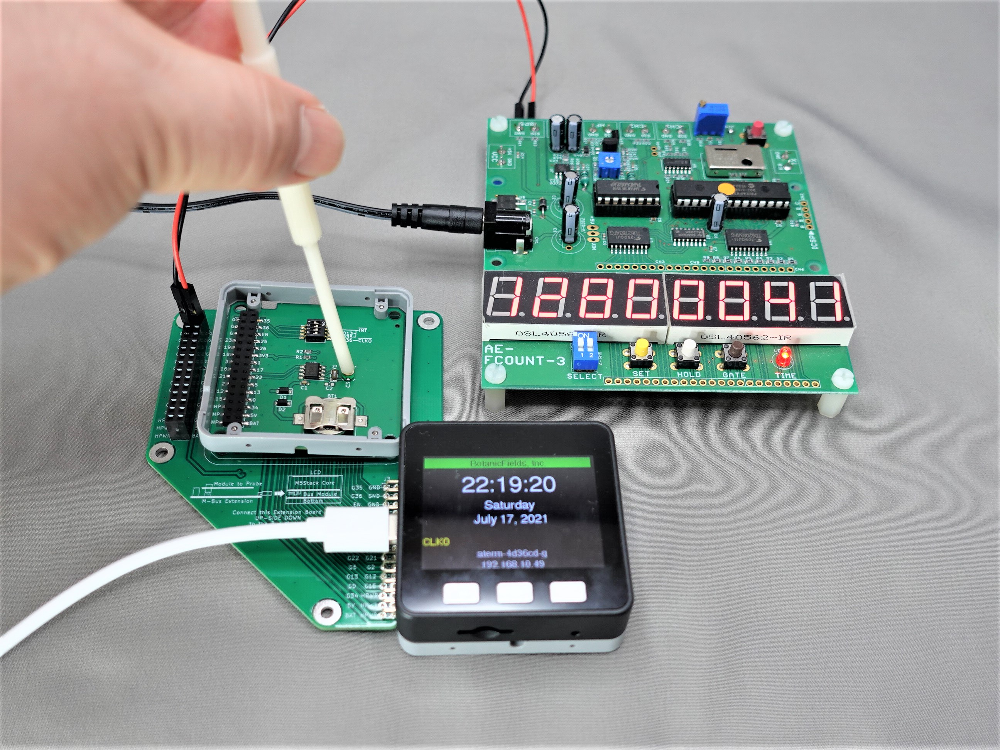

# PCB-MBUS-Extension
a Printed Circuit Board of M-BUS Extension for M5Stack

# M-busエクステンション基板キット
M5Stackの外にM-Busモジュールを接続するエクステンション基板のキットです。M5Stack用BUSモジュールに取り付けて使用します。
- M5StackのLCDやボタンを使いながら、M-Busモジュールの試験や調整ができます。
- プロービング用のピンソケットからジャンパーワイヤーでM-bus信号を観測できます。
- ボトムに出ていないM-Bus信号を観測できます。

## 内容物
- プリント基板 ×1
- M-Busピンソケット(M5Stack純正品) ×1
- ピンソケット(一般用15ピン2列) ×1
- ピンソケット(L型一般用15ピン2列) ×1

※ M5Stack用BUSモジュールは付属しません。別途ご用意ください。

 

## ご注意
- 組み立てには、はんだ付け（表面実装を含む）が必要です。
- M-Bus信号へのノイズ混入により動作が不安定になる場合があります。信号には手を触れない様にしてください。
- M5Stack用BUSモジュールを含め導線の電流容量が不足する可能性があります。GND, 5V, 3.3V, BAT, HPWR など、必要に応じてディスクリートワイヤなどで補強してください。
- 取り扱い説明書はありません。

## 使用方法
- M5Stack用BUSモジュールについて、BUSモジュール付属のL型ピンヘッダをはんだ付けし、モールド側面の開口部をカッター等で切り取ります。
- M5Stack用BUSモジュールに、組み立てたM-Busエクステンション基板を、**裏表が逆になるように取り付けます**。
- 本来、M5Stackの裏面側にあるM-Busモジュールが、エクステンション基板では表面を向きます。

 

## 使用例
RTCモジュールのCLKO信号を、M-Busエクステンション基板のGPIO36から取り出して周波数カウンタで観測しながら、RTCモジュールの水晶発振子のトリマを調整しています。M5StackのLCDも同時に見えます。

